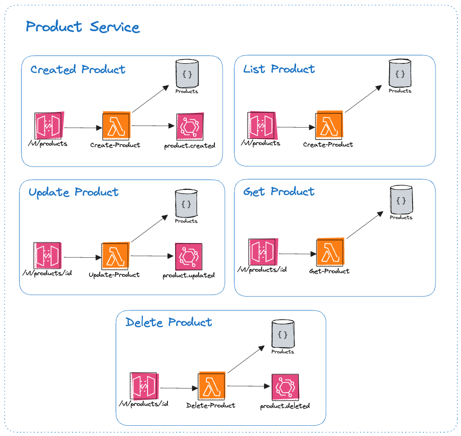

# Product Service (Product Hub)

## Objective

The proposal of this project is the responsibility to manage products of the fake e-commerce ecosystem (book-store).

For async integration, we are publishing events using the aws event-bridge as event bus.



## Events

### product.created or product.updated

```json
{
   "eventType":"product.created or product.updated",
   "publishedAt":"2023-12-02T20:55:48.790Z",
   "data":{
      "id":"01HGP513YXN9CYMN4WKNVWF4NB",
      "name":"iphone 14",
      "description":"iphone 14",
      "price":12000,
      "quantity":15,
      "category":"Fantasy",
      "createdAt":"2023-12-02T20:55:26.369Z",
      "updatedAt":"2023-12-02T20:55:26.369Z",
      "active":true,
      "deleted":false
   }
}
```
### product.deleted

```json
{
   "eventType":"product.deleted",
   "publishedAt":"2023-12-02T20:58:48.790Z",
   "data":{
      "id":"01HGP513YXN9CYMN4WKNVWF4NB"
   }
}
```
